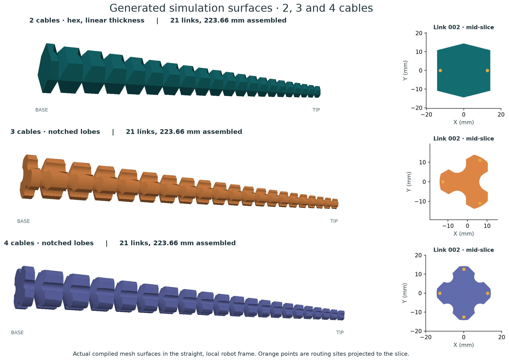
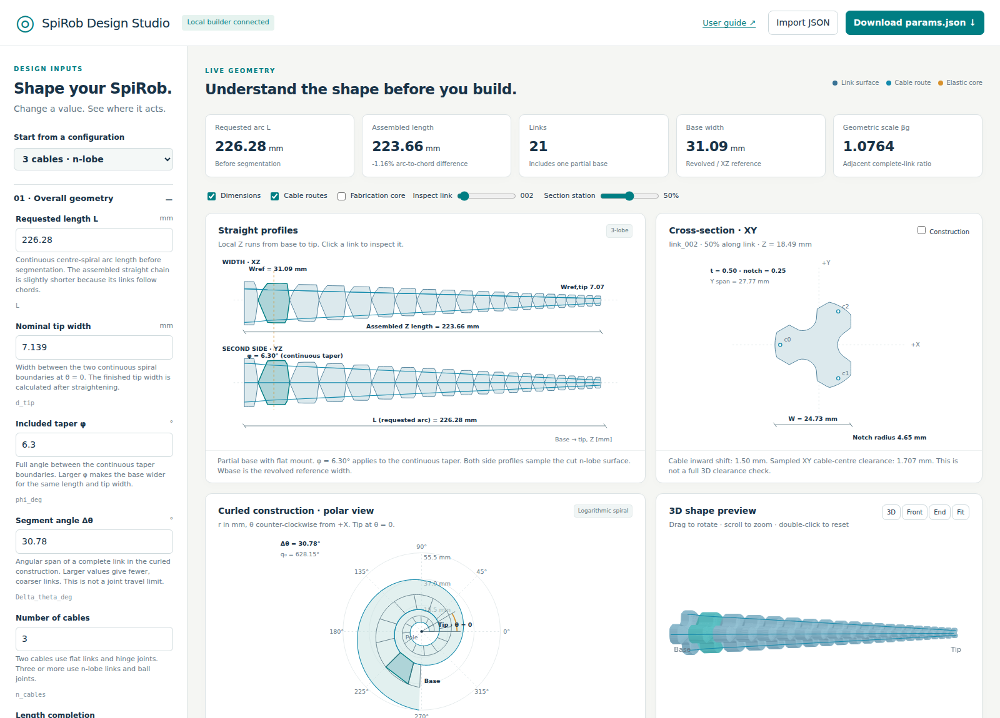
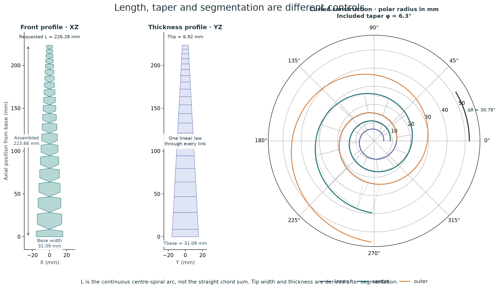
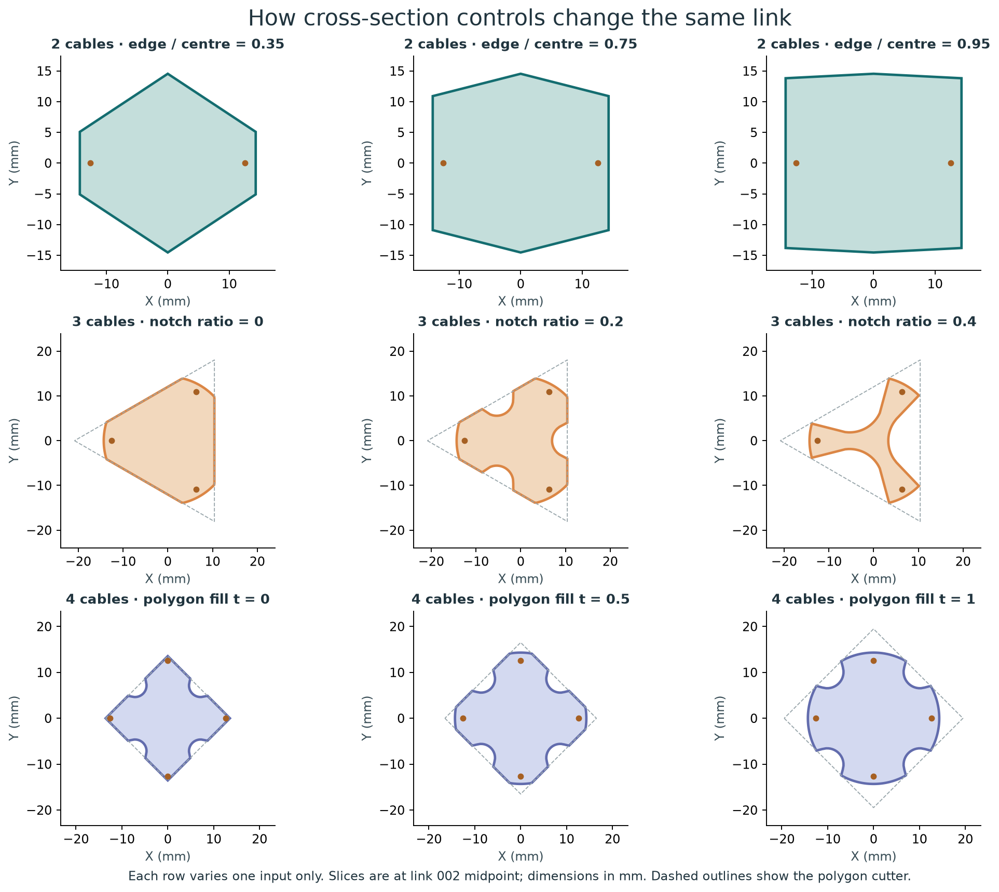
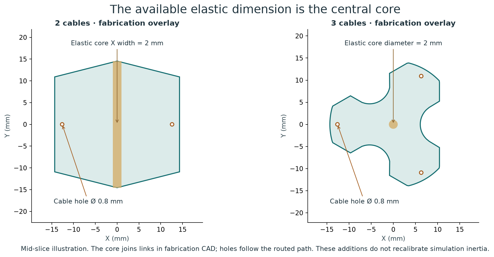
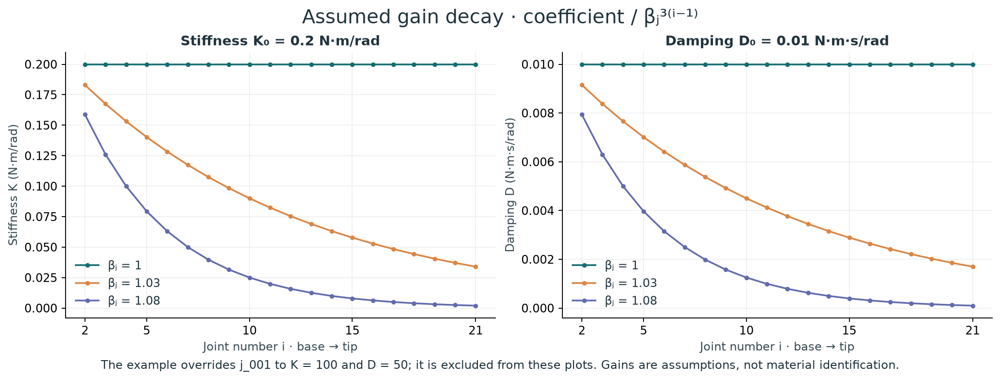

# SpiRob generator

Design a cable-driven SpiRob, inspect its geometry, and generate a **MuJoCo model** or **fabrication CAD** from one JSON file. Two cables use flat rectangular/hex links and hinge joints; three or more use notched n-lobe links and ball joints.



**Start here:** [Install and build](#install-and-build) · [Interactive designer](#interactive-designer) · [Parameters](#parameters) · [Geometry equations](#geometry-equations) · [Dynamics and contact](#dynamics-and-contact) · [Tools](#tools) · [GitHub hosting](#github-hosting) · [Verification and layout](#verification-and-layout)

## Install and build

The supported environment is **Python 3.12**, managed by [uv](https://docs.astral.sh/uv/getting-started/installation/). Run commands from the repository root. `uv sync` creates `.venv`; activation is optional. Dependencies, including CAD and MuJoCo, are locked in `uv.lock`.

```bash
git clone git@github.com:YADlin/spirob-physics-model-development-pipeline.git
cd spirob-physics-model-development-pipeline
git switch fix/consolidation-cad-workflows
uv sync --locked
uv run python tools/designer.py
```

The review branch is shown above; after it is merged, use `main`. The designer opens at **http://127.0.0.1:8765**. Select a preset, adjust its parameters, then download JSON or generate a model ZIP. Stop the server with Ctrl+C after a build finishes.

For a terminal build and viewer:

```bash
uv run python build.py --params examples/params-three-cable.json --no-preview --output-dir build/three
uv run python -m mujoco.viewer --mjcf build/three/spirob_physics_model.xml
```

For two-cable hex links with an explicit **20 mm base thickness**, STEP, printing STL and IGES:

```bash
uv run python build.py --params examples/params-two-cable-hex.json --base-thickness-mm 20 --cad --iges --no-preview --output-dir build/two
```

Every build compiles its XML before publishing outputs. Failed stages preserve the previous output. Rebuilding without CAD removes stale CAD from that output directory. The obsolete red `target` site is **absent from new XML**; regenerate old models to remove it there too.

| Output under the chosen directory | Purpose / units |
| --- | --- |
| `spirob_physics_model.xml` + `meshes/` | Portable simulation model. Keep these together; simulation STL coordinates are **metres**. |
| `build_params.json` | Input with resolved build/CLI overrides. Omitted dynamics values still use the documented preset. |
| `Geom_Data_CSV/` | Intermediate geometry table; useful for auditing, not required by the viewer. |
| `collision_summary.json` | Contact geometry counts, mass isolation and arena allocation. |
| `section_dimensions.json` | Two-cable base/tip thickness and per-link taper dimensions. |
| `cad/spirob.step`, `cad/spirob.stl` | Whole-robot manufacturing exports in **millimetres**, when CAD is enabled. |
| `cad/spirob.iges` | Optional **surface** interchange in mm; STEP is preferred for solids. |
| `cad/spirob_cad_report.json` | CAD validity, volumes, bounds, hashes and round-trip results. |
| `spirob_aligned.mjb` | Optional compiled frame-alignment experiment tied to MuJoCo 3.3.5. |

A fabrication STL and a simulation STL have different units and purposes. Do not send a metre-scale simulation mesh straight to a slicer expecting millimetres.

## Interactive designer



The same interface runs locally or as a static GitHub Pages site. No JavaScript framework, CDN or web account is required to explore a design.

1. Choose a **2-hex, 2-rectangular, 3-, 4- or 6-cable preset**. Other cable counts can be entered.
2. Change length, tip width, taper and segment angle. The **front/side profiles** distinguish requested length from assembled length.
3. Click a link or use **Inspect link**. Move **Section station** to see a real XY slice, rather than a misleading full-link projection. Toggle **Construction** for the polygon and notch cutters.
4. Expand **Section** or **Fabrication** to change thickness, notch, fill, core and hole dimensions. The cross-section reports sampled XY wall clearance. Toggle dimensions, routes and core separately to control clutter.
5. Inspect the polar construction, back-calculated constants, gain plots and rotatable 3D surface. **Front**, **End** and **Fit** provide predictable camera views.
6. Download `params.json`. With the local builder connected, **Generate & download model** runs the Python pipeline and returns the XML, meshes, optional CAD and reports in one ZIP.

The browser remembers the last valid design locally. Importing a JSON file restores its settings; invalid values disable export/build and leave the previous valid preview visible with an error. Length inputs display **mm** while JSON uses metres. Optional omitted settings are identified in the controls.

The 3D view is a sampled design preview, not a contact simulation. Fabrication core/channel overlays explain parameters; the generated CAD is authoritative for the fused/drilled solid. Root world pose is applied in MuJoCo, not in the local design views. Interactive previews and browser builds are bounded to **32 cables / 400 links**; the terminal generator has no 32-cable limit.

**GitHub Pages is static hosting:** it serves the previews and JSON export but cannot execute this Python/OpenCascade pipeline. Exact exports work through the local builder or the manual GitHub Actions workflow described below. See [GitHub Pages documentation](https://docs.github.com/en/pages/getting-started-with-github-pages/what-is-github-pages).

## Parameters

Start with an example and edit it, or use the designer. The schema in [`site/parameters.schema.json`](site/parameters.schema.json) supplies field descriptions, units and basic validation to both Python and the website. Unknown keys, invalid types and non-finite numbers are rejected.

**Precedence:** explicit CLI option → JSON → generator/preset default. Schema `default` entries describe initial designer values; they do not silently insert missing keys into an imported file. The tables distinguish example values from omitted-key behavior where it matters.

### Geometry and sections



| JSON key | Example / default | Meaning and effect |
| --- | --- | --- |
| `L` | `0.22628` m; required | Continuous centre-spiral arc length before straightening. The assembled chain follows chords and is slightly shorter. |
| `d_tip` | `0.007139` m; required | Nominal width between spiral boundaries at θ=0. It is not necessarily the final measured tip width after segmentation. |
| `phi_deg` | `6.3`; required | Full included taper angle φ, **0 < φ < 45°**. Increasing it widens the base at a fixed length/tip input. |
| `Delta_theta_deg` | `30.78`; required | Curled angular span per complete link, **0 < Δθ < 180°**. Larger values mean fewer links; it is not a joint limit. |
| `n_cables` | `3`; required | Integer ≥2. Selects flat hinge links for 2, n-lobe ball-joint links for n≥3. |
| `terminal_unit_policy` | `exact_requested_length` | Preserve requested arc length and allow a partial base; `whole_units` extends the arc to the next complete link. An excessively short partial base is rejected; use whole units or adjust L/Δθ. |
| `tendon_inward_shift` | `0.0015` m; required | Inward routing-site offset; **0 ≤ shift < d_tip/2**. The distal site also receives a taper correction. This is not a guaranteed distance from a drilled hole to the actual outer surface. |
| `base_thickness_m` | `null` / auto | **2-cable only.** Full Y centre thickness at the base mounting plane. Auto equals base width; a number fixes that base thickness. Tip thickness is derived, not independently entered. |
| `thickness_profile` | `linear` | **2-cable only.** One continuous thickness law within and between links. `stepped` is the legacy constant-thickness-per-link alternative. |
| `flat_section` | `rectangular` | **2-cable only.** `hex` adds two centre ridges, giving a six-sided section; it is generally not a regular hexagon. |
| `hex_edge_ratio` | `0.75` | Hex only; **0 < ratio < 1**. Edge/centre thickness ratio at the link's full-width section. Sloped end-face clipping also changes a slice near a joint. |
| `nlobe_t` | `0.5` | **n≥3.** Polygon fill, **0–1**. Sets polygon circumradius relative to the revolved reference radius; changing it changes the lobe outline. |
| `notch_factor` | `0.25` | **n≥3.** Notch radius / half polygon-side length, **0–0.4**. Zero means no notch. Convex contact bridges these concavities. |
| `show_preview` | `false`; required | Open the optional desktop 2D approval window during a CLI build. `--no-preview` and the local browser builder suppress it. |



For two cables the thickness law is

$$T(z)=T_\mathrm{base}\frac{z_\mathrm{apex}-z}{z_\mathrm{apex}-z_\mathrm{base}}.$$

The virtual apex continues the geometric sequence beyond the tip. This gives a linear taper and preserves similarity of complete links, so they can share an STL. The partial base gets its own STL. See `section_dimensions.json` for the resulting **base and tip** dimensions.

### Placement and dynamics: `post_gen`

These keys belong inside a `"post_gen": {...}` object. They are optional; examples explicitly set them for reproducibility.

| Key | Example | Meaning / omitted-key behavior |
| --- | --- | --- |
| `robot_pos` | `[0,0,0.22628]` m | Root body world position. If omitted, use the generated root position. |
| `robot_quat` | `[0,0,-1,0]` | Root orientation `[w,x,y,z]`, nonzero. The example points local +Z down. If omitted, use the generated orientation. |
| `joint_stiffness_base` | `0.2` N·m/rad | K₀ coefficient of the gain law below. Omitted uses the chosen preset. |
| `joint_damping_base` | `0.01` N·m·s/rad | D₀ coefficient; omitted uses the preset. |
| `joint_beta` | `1.03` | Positive gain-decay βⱼ, independent of geometric βg. Above 1 gives decreasing gains; 1 gives constant gains. |
| `first_joint_stiffness` | `100` N·m/rad | Override j_001 only. If omitted, j_001 follows K₀. A large spring approximates a fixed mounting; it is not a weld. |
| `first_joint_damping` | `50` N·m·s/rad | Override j_001 only. If omitted, it follows D₀. |
| `timestep` | `0.0001` s | Positive integration step. All supplied examples set this explicitly. Omitted uses the preset, which can be much coarser. |
| `tip_site_pos` | `[0,0,0.005]` m | Optional `tip_site` location in the **last body's local frame**; not a world position or guaranteed physical tip. Omitted means no tip site. |

`post_gen.target_site_pos` is retired: imports remove it with a notice and no target is emitted. The `--show-target-marker` flag has been removed.

### Export, collision and fabrication: `build`

These keys belong inside a `"build": {...}` object. The two example build entries are `collision_mode: "convex"` and `mesh_layout: "shared"`; other entries can be added in JSON or selected in the designer.

| Key | Default / example | Meaning |
| --- | --- | --- |
| `collision_mode` | Examples: `convex` | One massless convex hull per link. Alternatives: `mesh`, `capsule`, `compound`; comparison below. Omitted: mesh, or capsule with safe preset. |
| `mesh_layout` | `shared` | Reuse a complete-link STL plus a partial-base STL where needed. `individual` creates one mesh file per link. Names inside XML remain stable. |
| `physics_preset` | `default` | `default`, `safe`, `fast`, `high`. Selects the legacy dynamics/contact defaults; explicit overrides still win. |
| `collision_margin_m` | `null` / auto | Nonnegative activation margin in metres. Auto is **0 for convex/compound**, otherwise the preset value. |
| `collision_corner_radius_ratio` | `0.04` | Corner radius / half-width for legacy compound colliders only. Does not affect convex. |
| `arena_memory_mib` | `null` / auto | Positive integer native MuJoCo arena size. Auto is 128 MiB for compound, compiler default otherwise. More memory does not fix unstable dynamics. |
| `plain` | `false` | Advanced revolved circular-section comparison; bypasses flat/n-lobe cutters. Incompatible with convex/compound and explicit flat-section settings. |
| `align_geom_frames` | `false` | Additional version-specific aligned `.mjb`. Ordinary XML still uses MuJoCo's mesh principal frames. Usually leave off. |
| `cad` | `false` | Enable whole-robot STEP and mm STL export plus validation report. |
| `cad_profile` | `fabrication` | `fabrication` fuses a central elastic core and optional channels. `simulation` assembles the rigid link surfaces; it is not necessarily one printable part. |
| `neck_width_mm` | `1` mm | Fabrication elastic core **X width for 2 cables**, **cylinder diameter for n≥3**. Must be positive. It is not the link Y thickness. |
| `cable_hole_diameter_mm` | `0` mm | Fabrication channel diameter; 0 leaves CAD undrilled. Positive diameters require fabrication profile. Does not change tendon display width or simulation mass. |
| `fuse_cad` | `false` | Fuse simulation-profile solids where possible. Fabrication is already fused. Requires CAD. |
| `iges` | `false` | Also export IGES surfaces, in mm. Requires CAD; STEP remains the solid exchange format. |



**What “elastic layer thickness” means here:** the implemented control is `neck_width_mm`, the finite central ligament/core. There is **no separate parameter for an axial elastic layer between rigid elements**. Changing this CAD dimension does not automatically identify a new spring/damping law. The browser labels the dimension that the generator actually supports.

Cable-hole margin depends on the selected link, slice, notch shape, taper and hole diameter. The browser's XY clearance estimate is useful for locating thin walls, but is not a 3D minimum-wall or print-strength certification. Check the exported solid before printing.

### Compatibility inputs and command-line help

| Retained input | Purpose |
| --- | --- |
| `flat_thickness_ratio` | Old two-cable base thickness/width ratio, 0.05–1; mutually exclusive with `base_thickness_m`. Prefer absolute base thickness. |
| `flat_edge_ratio` | Old fabrication lens edge ratio, (0,1]; not the current hex-section control. |
| `taper_angle_deg` | Legacy alias; must agree with `phi_deg`. Use `phi_deg` in new files. |
| `build.flat_thickness_m`, `build.flat_edge_ratio` | Legacy stepped fabrication-lens overrides. Not supported with hex/linear thickness. |
| `_comment` | Optional explanatory string at root, in `post_gen`, or in `build`. |

Every terminal flag has help text:

```bash
uv run python build.py --help
uv run python tools/set_joint_gains.py --help
uv run python tools/add_touch_sensors.py --help
```

CLI names use hyphens: e.g. `--collision-mode convex`, `--arena-memory-mib 128`, `--neck-width-mm 1`. `--base-thickness-mm 20` converts mm to the JSON metre value; `--base-thickness-mm auto` restores thickness=width. `--hex-section` selects hex, `--safe/--fast/--high` select a preset, and `--nlobe` restores the cable-count-driven section after `build.plain`. `--no-cad`, `--no-iges`, `--no-fuse-cad`, and `--no-align-geom-frames` can disable JSON options. `--noclean` is a retained no-op: builds always use fresh staging.

## Geometry equations

The original design principle is the logarithmic spiral **r(θ)=a exp(bθ)**, described by Wang, Freris and Wei in [SpiRobs: Logarithmic Spiral-shaped Robots for Versatile Grasping Across Scales](https://arxiv.org/abs/2303.09861). This generator solves for constants from more direct design inputs; the website displays their current values.

Let $E=e^{2\pi b}$. In this repository's convention:

$$r_\mathrm{in}(\theta)=ae^{b\theta},\quad r_\mathrm{out}(\theta)=ae^{b(\theta+2\pi)},\quad r_c(\theta)=\frac{a(E+1)}{2}e^{b\theta}.$$

$$\tan(\phi/2)=\frac{b(E-1)}{\sqrt{1+b^2}(E+1)},\qquad a=\frac{d_\mathrm{tip}}{E-1}.$$

$$A=\frac{\sqrt{1+b^2}\,a(E+1)}{2b},\qquad L=A(e^{bq_0}-1),\qquad q_0=\frac{\ln(1+L/A)}{b}.$$

Angles in these equations are **radians**. Complete units span Δθ and have geometric size ratio $\beta_g=e^{b\Delta\theta}$. The generator straightens each centre chord, reverses tip-to-base construction into base-to-tip numbering, and corrects a partial base's mounting face. Hence requested continuous length, discrete length and measured end widths differ. Whole-unit policy rounds the angular span upward before assembly.

For n-lobe links, the cutter has polygon circumradius $R_p=R[1+t(\sec(\pi/n)-1)]$ and notch radius $r_n=\text{notch_factor}\,R_p\sin(\pi/n)$. The actual slice also includes axial draft and the revolved slit envelope; the website applies both.

## Dynamics and contact



For base-to-tip joint number $i=1,\ldots,N$:

$$K_i=K_0/\beta_j^{3(i-1)},\qquad D_i=D_0/\beta_j^{3(i-1)}.$$

This is an **assumed exponential law** with the same exponent for damping and stiffness. It is not fitted automatically to the printed material or inferred from CAD. βⱼ is independent of geometric βg. There is no linear joint-gain mode; the linear option described earlier refers to **link thickness**. The example's j_001 overrides are applied after this law. For ball joints, damping applies to their three rotational degrees of freedom.

Legacy presets are retained, with their limitations visible:

| Preset | Timestep if omitted | Integrator | K₀ / D₀ if omitted | Motor control range | Margin for mesh/capsule |
| --- | --- | --- | --- | --- | --- |
| default | 0.002 s | implicit | 0.2 / 0.01 | −10 to 0 | 0.001 m |
| safe | 0.001 s | implicit | 0.2 / 0.2 | −5 to 5 | 0.0002 m |
| fast | 0.005 s | implicit | 0.01 / 0.001 | −10 to 10 | 0.002 m |
| high | 0.0005 s | RK4 | 0.1 / 0.02 | −5 to 5 | 0.0005 m |

**All current examples explicitly use 0.0001 s.** Their explicit K₀/D₀ also override preset gains. Preset names are not stability or physical-accuracy guarantees. Keep your known tolerable timestep and test the intended force/load range. With the default motor convention, negative control tensions the tendon; the symmetric legacy ranges also permit the opposite sign. Cable motors are idealized, not a hardware motor/cable model.

| Contact mode | Use / approximation |
| --- | --- |
| `convex` | Recommended starting point in examples: one massless contact hull per link, independent visual mesh and explicit inertia. Supports flat and n-lobe links. Bridges n-lobe concave notches. Multiple contact points can still be necessary for a broad face. |
| `mesh` | MuJoCo mesh contact uses a convex hull; it does not reproduce arbitrary concavity. Retains older contact settings. |
| `capsule` | Cheap rounded approximation, which can differ noticeably from flat faces. |
| `compound` | Legacy boxes/cylinders for **stepped rectangular two-cable links only**. More geom pairs and contacts; retained for comparisons. |

One hull per link reduces the number of contact geoms; it does **not** guarantee one contact or constraint per link. Dense folded configurations can still produce many contacts. Inspect force aggregation and solver statistics before increasing memory. Viewer `100% (76.2%)` describes requested versus achieved real-time speed; it is not an accuracy score.

Mass, COM and inertia are frozen into explicit `<inertial>` elements from the **simulation visual meshes** at generation time, using uniform density **1200 kg/m³**. Collision proxies have zero mass. Fabrication ligaments, holes, print infill and material variation are not automatically incorporated into this model. Geometry/density changes require regeneration; measured hardware properties require separate calibration. `audit_inertia.py` compares the assumptions transparently.

MuJoCo can rotate mesh geom frames to principal axes during compilation. This does not by itself rotate the physical surface incorrectly. Body/site naming is retained: `link_NNN`, `j_NNN`, `cC_NNN_s1/s2`, `cable_C`, `motor_cC`, and optional `tip_site`. See [MuJoCo's mesh documentation](https://mujoco.readthedocs.io/en/3.3.5/XMLreference.html#asset-mesh).

## Tools

All tools are included in the repository. Run them from the repository root. XML editing tools write a **separate compiled output** and rebase asset paths; keep the original meshes available. Use `--help` for complete options.

| Tool | When it helps |
| --- | --- |
| `tools/designer.py` | Interactive design and exact local model/CAD ZIP generation. `design_gui.py` is a compatibility launcher for this interface. |
| `tools/set_joint_gains.py` | Tune one stiffness/damping coefficient and decay factor across joints; always preserves j_001 and optional extra exclusions. |
| `tools/add_touch_sensors.py` | Add named spherical touch regions near cable routes while preserving existing sensors and physical properties. |
| `tools/audit_inertia.py` | Compare compiled mass/COM/inertia against the triangle mesh, independent simulation CAD, and optionally an older XML. |
| `tools/inspect_collision.py` | Show CAD and contact proxies, report counts/mass separation, or run a bounded actuator/contact stress test. |
| `tools/inspect_collision_surface.py` | Plot and quantify the visual-surface versus collision-hull difference, especially bridged n-lobe notches. |
| `tools/inspect_contact_forces.py` | Sum world-frame contact forces and moments on a body or within a chosen body-local spherical region. |
| `tools/inspect_section.py` | Plot actual compiled mesh projections and 3D views in body coordinates. Its end-on projection is not a planar slice. |
| `tools/inspect_taper.py` | Check two-cable thickness continuity against the requested law; optionally compare an older XML. |
| `tools/multi_array.py` | Assemble a circular array of robots with namespaced names and shared assets. |
| `fabrication/part_splitter.py` | Split STEP/STL to an axial printer span or explicit cuts; records part bounds and volumes. It does not add assembly keys or restore flexure continuity. |
| `tools/preview.py` | Optional desktop 2D geometry approval window used by `show_preview`. |
| `tools/inspect_model.py` | Advanced body/geom-frame inspection and optional compiled alignment. |
| `tools/geometry_audit.py` | Advanced requested/discrete length and geometry-policy report. |
| `tools/benchmark_collision.py` | Developer comparison of collider contact counts, timings and dense poses. Not a hardware validation. |

### Change gains and preserve the base

```bash
uv run python tools/set_joint_gains.py --mjcf build/three/spirob_physics_model.xml --out build/three/tuned.xml --stiffness 0.15 --damping 0.008 --beta 1.03 --json build/three/gain_changes.json
uv run python -m mujoco.viewer --mjcf build/three/tuned.xml
```

By default, the coefficient is anchored at the generator's i=1, while j_001 is preserved. Therefore j_002 gets coefficient/β³. Add `--anchor first-flexible` if the entered value should be the actual value at j_002. The tool verifies unchanged inertia, geometry, sites and actuator settings. For a permanent rebuild setting, also edit the corresponding `post_gen` values in your source JSON.

### Compare inertia in a useful frame

```bash
uv run python tools/audit_inertia.py --mjcf build/three/spirob_physics_model.xml --params build/three/build_params.json --links link_001 link_002 link_021 --json build/three/inertia.json
```

Reports express the tensor **at the compiled COM, with axes parallel to the link body frame**. CAD/mesh tensors are shifted to that same point before comparison, and each reference COM is reported separately. MuJoCo's diagonal principal moments alone would not permit a meaningful element-by-element comparison with a differently rotated CAD tensor. The reference is homogeneous CAD, not a measurement of a printed part. Adjust link names for a different link count.

### Inspect contact geometry and forces

```bash
uv run python tools/inspect_collision.py --mjcf build/three/spirob_physics_model.xml --view
uv run python tools/inspect_collision.py --mjcf build/three/spirob_physics_model.xml --stress --controls -2 0 0 --seconds 2 --ramp-seconds 1 --json build/three/contact_stress.json
uv run python tools/inspect_collision_surface.py --mjcf build/three/spirob_physics_model.xml --out build/three/contact_surfaces.png --json build/three/contact_surfaces.json
uv run python tools/inspect_contact_forces.py --mjcf build/three/spirob_physics_model.xml --body link_002 --seconds 2 --controls -2 0 0 --ramp-seconds 1 --json build/three/forces.json
```

For a region rather than the whole link, add `--point-local-m X Y Z --radius-m R`. A finite region aggregates nearby contacts; a mathematical point does not define a unique contact-force distribution. Reports state which body receives the force and the moment reference. No-contact states naturally return zero.

### Add touch readings

```bash
uv run python tools/add_touch_sensors.py --mjcf build/three/spirob_physics_model.xml --out build/three/touch.xml --links 2 3 --offset-mm 1.8 --radius-mm 3
```

This adds regions named `cs_NNN_cC` and sensors named `touch_NNN_cC`. MuJoCo touch readings sum **normal contact-force magnitudes** within a region; they are not independent 3D force vectors. Overlapping regions may count the same contact. Use the contact-force inspector for vector forces and moments. See [MuJoCo touch sensor semantics](https://mujoco.readthedocs.io/en/3.3.5/XMLreference.html#sensor-touch).

### Check thickness, make an array, or split a print

```bash
uv run python tools/inspect_taper.py --mjcf build/two/spirob_physics_model.xml --params build/two/build_params.json --out build/two/taper.png --json build/two/taper.json
uv run python tools/inspect_section.py --mjcf build/three/spirob_physics_model.xml --out build/three/sections.png
uv run python tools/multi_array.py --in build/three/spirob_physics_model.xml --count 4 --radius-m 0.12 --out build/array.xml
uv run python fabrication/part_splitter.py build/two/cad/spirob.step --axis z --max-span-mm 100 --file-units mm --out-dir build/two/print-parts
```

Fabrication exports use the robot's local +Z axis. Splitting reports geometric pieces, not a tested mechanical connection. Inspect where the core and cable channels intersect each cut.

## GitHub hosting

The site and workflows are included; publication is a separate repository action. You can review everything locally before merging.

**After the workflow files reach the default branch:**

1. In GitHub, open **Settings → Pages → Build and deployment → Source: GitHub Actions**.
2. Open **Actions → Deploy SpiRob designer → Run workflow**. Select the branch/ref you intend to publish.
3. Use the URL reported by the deployment. For this repository, the normal project URL is `https://yadlin.github.io/spirob-physics-model-development-pipeline/`; it becomes available only after a successful deployment.
4. To generate files on GitHub, open **Actions → Generate SpiRob model → Run workflow**. Choose a preset or paste a complete exported JSON. Enable `build.cad` and `build.iges` in that JSON for CAD/IGES. Download `spirob-model` from the completed run's artifacts (retained for 14 days).

The website never asks for a GitHub token. Manual Actions builds require repository write access; public visitors can use JSON export and the local builder. A manual workflow must exist on the default branch before GitHub exposes it, even if a later run selects another branch. See [manual workflow requirements](https://docs.github.com/en/actions/how-tos/manage-workflow-runs/manually-run-a-workflow) and [Pages custom workflows](https://docs.github.com/en/pages/getting-started-with-github-pages/using-custom-workflows-with-github-pages).

## Verification and layout

```bash
uv sync --locked
uv run pytest -q
```

For website development, Node 22+ is needed only for checks, not for serving the site:

```bash
uv run python dev/check_web_geometry.py
uv run python dev/check_web_sections.py
npm --prefix dev/browser ci
cd dev/browser
npx playwright install chromium
cd ../..
node dev/browser/check.mjs
uv run python dev/render_readme_figures.py
```

The browser check exercises real controls, JSON persistence, mobile layout and a downloadable XML/STL/STEP/IGES build. Geometry parity compares 24 browser/Python configurations. README figures are reproducible from generated meshes and the same section equations; they are not hand-drawn approximations of hardware.

**Known test status:** one strict expected failure records the retained distal-tendon taper correction (F08), which does not produce a constant surface offset. It is not an unexplained crash; changing it needs a separate routing/physics decision. Sixteen skips cover unsupported n-cable compound combinations; three skips exclude non-legacy profiles from a deliberately legacy benchmark. These do not skip convex coverage. Unexpected failures or new skips still need investigation. See the [current branch audit](docs/engineering/BRANCH_AUDIT.md) for measured results and remaining work.

| Location | Responsibility |
| --- | --- |
| `build.py`, `params.json`, `examples/` | User entry point and reproducible input configurations. |
| `spirob/geometry.py`, `sections.py`, `collision.py` | Canonical geometry, cross-sections and collision construction. |
| `spirob/pipeline/` | CSV, STL, MJCF and CAD stages; normally called through `build.py`. |
| `spirob/parameters.py`, `xml_tools.py`, `mesh_assets.py` | Validation, safe XML editing and shared mesh mapping. |
| `tools/`, `fabrication/` | User inspection/tuning tools and print splitting. |
| `site/` | Static designer, shared parameter schema and browser presets. |
| `tests/`, `dev/` | Regression tests, independent legacy reference and browser/figure checks. |
| `docs/figures/`, `docs/engineering/` | README illustrations and detailed engineering history. This README is the current user guide. |
| `build/` | Generated models, reports and downloads; ignored by Git. |
| `pyproject.toml`, `uv.lock` | Supported environment and reproducible dependencies. |

The former root-stage scripts moved to `spirob/pipeline/`; use `build.py` instead of invoking those stages by path. `design_gui.py` now opens the browser designer. The old touch script and XML updater are replaced by the tools above. Duplicate DOCX/HTML/manual versions and requirements lists were removed. Old engineering reports are explicitly marked historical. Existing ignored root outputs are not deleted automatically; the new default build location is `build/spirob`.

For contributor changes, create a branch, run relevant tests, review `git diff`, commit source changes explicitly, and submit a PR. Do not commit generated model folders or `.venv`. The locked environment is intended for this repository checkout; installing an arbitrary standalone wheel is not the documented workflow.

## Scope and attribution

This is an independent MIT implementation extending the geometry and naming conventions of this repository. The original design and research are credited to [Zhanchi Wang, Nikolaos M. Freris and Xi Wei](https://arxiv.org/abs/2303.09861); their [Open-Spiral-Robots repository](https://github.com/ZhanchiWang/Open-Spiral-Robots) remains a separate project with its own license. Its noncommercial source is not incorporated here. CADQuery/OpenCascade, MuJoCo and other dependencies retain their respective licenses.

Remaining physical work includes experimental stiffness/damping identification, printed-part inertia calibration, and contact validation in deep concavities. The current n-lobe CAD path retains individual solid construction: extending shared-solid reuse showed small numerical volume differences and is deferred until independently resolved.
