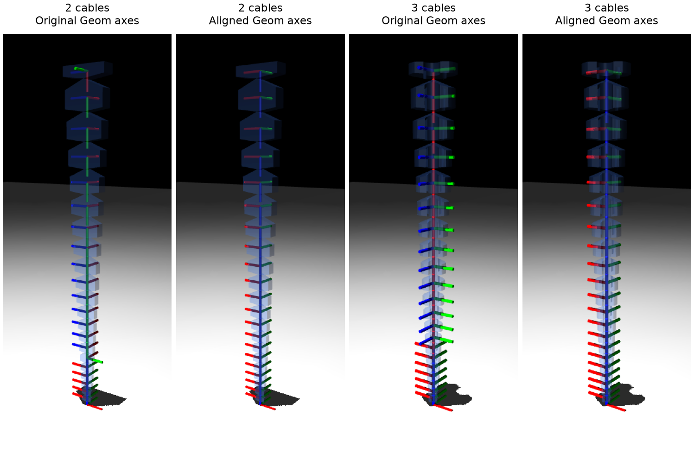

# Actual Geom-frame alignment — 10 September 2026

This follow-up preserves the accepted base surface correction in `4b464d2`.
The previous Body-frame viewer did not align Geom frames. The new opt-in path
aligns the actual `geom_xmat` axes returned by `mj_forward`, and the viewer uses
MuJoCo's real **Geom** frame display.



## Cause and significance

The supplied examples reproduce these compiled local geom quaternions (wxyz):

| Model | Links | Quaternion, approximately |
|---|---|---|
| Two cables | 1 | (0, .7071, 0, .7071) |
| Two cables | 2–15 | (.5, .5, .5, .5) |
| Two cables | 16 | (.7071, 0, 0, .7071) |
| Two cables | 17–21 | (1, 0, 0, 0) |
| Three cables | 1–14 | (.5, .5, −.5, .5) |
| Three cables | 15–21 | (1, 0, 0, 0) |

MuJoCo 3.3.5 centres ordinary meshes and aligns their coordinates with computed
principal inertia axes. It compensates by changing the geom placement, so the
rendered mesh surface retains its authored pose. Its XML schema has no option
to disable this operation for ordinary mesh geoms. Setting `quat="1 0 0 0"` in
the source geom does not prevent it.
[MuJoCo mesh reference](https://mujoco.readthedocs.io/en/3.3.5/XMLreference.html#asset-mesh)

This frame difference alone does not mean that links, joints or collision
surfaces are physically misoriented. It matters to code reading `geom_xmat`,
geom orientation sensors, or vectors expressed in geom-local coordinates.
The frame's origin remains at the compiled mesh centre, while the body origin
remains at the link/joint origin. The alignment option changes orientation,
not these origins. During bending, each geom follows its own body; the entire
chain's axes should only be parallel in the straight reference pose.

The authors' repository tree does not contain a published simulation XML to
compare directly. No assertion is made here about their compiled model, and
none of their generator implementation was used for this repair.

## Implementation

`spirob.mujoco_frames.aligned_geom_model(model)` returns an independent compiled
model. For each standalone `link_NNN` mesh geom, with old local rotation R:

1. Replace compiled mesh vertices v with Rv and rotate vertex/polygon normals.
2. Rotate mesh BVH boxes conservatively and update geom bounds used by rays.
3. Set the actual geom quaternion to identity and update `geom_sameframe` to
   `BODYROT`. Leaving the old `INERTIA` shortcut would ignore the new quaternion.
4. Compensate `mesh_quat`, retaining the authored mesh-to-body relationship.

The world surface is preserved because `R_body R v` becomes `R_body (Rv)`.
Geom centres, body mass, inertial pose and diagonal inertia are retained.
Body BVHs are already in the unchanged body inertial frame. The original
bounding-sphere radius is retained because it remains valid under rotation
and controls the convex collision solver's relative tolerance.

Build-time CSV, STL, XML and CAD generation are unchanged by this option.
It does not flip links or alter tendon, site, joint or actuator definitions.

## Run it

From the generator checkout with its uv-managed environment active:

```bash
uv pip install --python .venv/bin/python -r requirements-dev.txt

# Inspect an existing XML, aligning actual Geom axes in memory:
python tools/inspect_model.py --mjcf build/two-cable/spirob_physics_model.xml --align-geom-frames --view

# Also save that aligned compiled model:
python tools/inspect_model.py --mjcf build/two-cable/spirob_physics_model.xml --align-geom-frames --save-mjb build/two-cable/spirob_aligned.mjb

# Or generate XML/STL and aligned MJB together:
python build.py --params examples/params-two-cable.json --no-preview --output-dir build/two-cable --align-geom-frames
python build.py --params examples/params-three-cable.json --no-preview --output-dir build/three-cable --align-geom-frames

# Inspect the saved model; no alignment flag is needed when reopening MJB:
python tools/inspect_model.py --model build/two-cable/spirob_aligned.mjb --view
python tools/inspect_model.py --model build/three-cable/spirob_aligned.mjb --view

# Run dynamics in the standard viewer; select Rendering > Frame > Geom:
python -m mujoco.viewer --mjcf=build/two-cable/spirob_aligned.mjb
```

The report prints both `Authored mesh/body rest frames aligned` and
`Actual Geom axes aligned with bodies`. Both should be `True` for an aligned
straight model. Omitting `--align-geom-frames` on an XML reports the original
misaligned Geom axes and returns exit code 1. `--json` gives per-link values;
`--frames body` explicitly requests Body frames in the viewer.

The GUI's **Inspect link frames** applies the alignment in memory and shows
Geom axes. Desktop interaction still needs workstation acceptance; offscreen
native MuJoCo rendering was checked in this environment.

For Python consumers running from this checkout:

```python
import mujoco
from spirob.mujoco_frames import aligned_geom_model

model = mujoco.MjModel.from_xml_path("build/two-cable/spirob_physics_model.xml")
model = aligned_geom_model(model)  # before MjData, renderer, or GPU conversion
data = mujoco.MjData(model)
mujoco.mj_forward(model, data)
```

## Boundaries

- **XML reload recompiles and restores the principal-axis frames.** Use the
  loader above or the optional `.mjb`. Do not convert the aligned model back to
  XML and expect the frames to persist. MJB is a compiled, version-specific
  artifact; this feature requires the pinned MuJoCo **3.3.5**.
  [MuJoCo model saving](https://mujoco.readthedocs.io/en/3.3.5/modeling.html#saving-models)
- Regenerate MJB when the robot changes. A successful build without the option
  retires any previous `spirob_aligned.mjb`, preventing stale model reuse.
- This helper supports canonical standalone SpiRob meshes, not robot arrays
  with shared assets, plugins/SDF octrees, textured link geoms, ellipsoid fluid
  interactions or arbitrary mesh placements. Unsupported inputs fail explicitly.
- Body/site consumers keep their convention. Geom-local observations and
  orientation sensors deliberately change; existing policies that use them
  require review. No mjlab or GPU/MJX training equivalence is claimed.
- Floating-point collision/ray computations are not guaranteed bit-identical.
  In particular, exactly axis-parallel rays through zero-width triangle bounds
  can differ at a numerical boundary. The ray regressions use oblique rays and
  compare both mesh and full-scene intersections.

## Verification

Full suite: **219 passed, 1 pre-existing xfailed**, in 70.61 seconds. The expected
failure remains the previously documented F-08 tendon-routing question.

Regression checks cover 2-, 3- and 4-cable generated models, including all
21 links, reference and bent poses, original-model immutability, repeated
alignment, and binary save/reload. They compare actual world vertices/normals,
all body/joint/site/tendon/actuator arrays, cable lengths, and mesh/scene rays.
Nonzero negative tendon controls are used for a 200-step dynamics comparison.
Sphere/box obstacles touching every link exercise contact distances, positions,
normals and a 20-step contact trajectory. Geom-frame alignment is checked from
`MjData.geom_xmat`, so a changed quaternion alone cannot pass the regression.

A four-cable build with aligned MJB was reopened and audited successfully.
Rebuilding without alignment retired that MJB and reproduced the XML and all
21 source STLs byte-for-byte. The two-/three-cable figure above was rendered
with native MuJoCo Geom frames using the same camera before and after alignment;
only display transparency/frame size were adjusted for visibility.

The dev requirements now explicitly include SciPy, which the existing STL
nearest-neighbour regression already imported.
