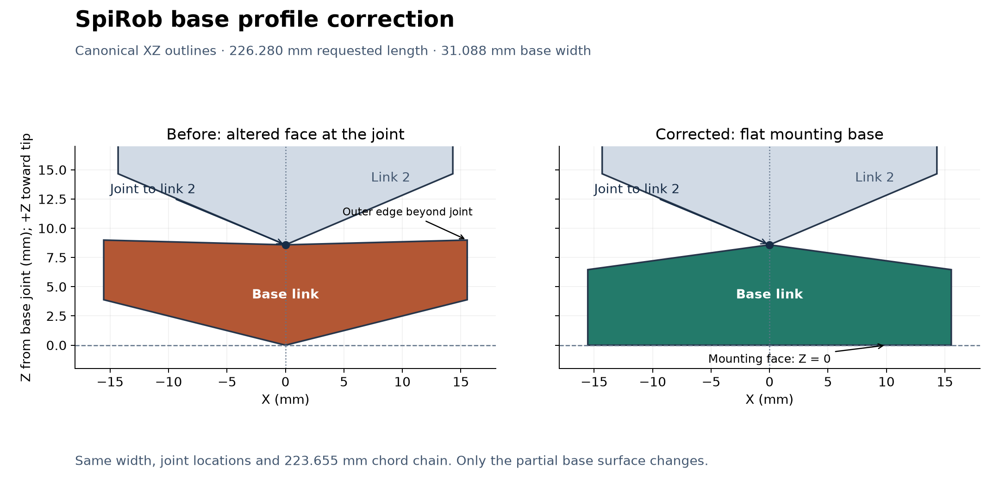

# Link frames and partial base — 9 September 2026

The base correction below is retained. The frame-viewing workaround described
here is historical: the [10 September Geom-frame update](GEOM_FRAME_ALIGNMENT.md)
adds opt-in alignment of the actual compiled Geom frames.

This follow-up stays on `fix/consolidation-cad-workflows`, above `5d5b20a`.
The user pushed that commit successfully using SSH. This round addresses the
reported link-frame inconsistency and the partial base's reversed-looking cut.

## What the frame display showed

The report was reproduced with MuJoCo 3.3.5. In the two-cable model, the compiled
geom quaternion differs for link 1, links 2–15, link 16 and links 17–21. In the
three-cable model it differs between links 1–14 and links 15–21. All 21 body
frames align at the reference pose in both models.

MuJoCo centres each mesh and aligns it to its principal inertia axes during
compilation, composing the inverse change into the geom placement. Consequently,
the displayed Geom axes can change without rotating the rendered surface.
[MuJoCo 3.3.5 mesh documentation](https://mujoco.readthedocs.io/en/3.3.5/XMLreference.html#asset-mesh)

`tools/inspect_model.py` audits both the body axes and the authored mesh frame,
undoing `mesh_quat`/`mesh_pos` from the compiled geom transform. Its optional
viewer uses **Body** frames and does not advance physics. Joint sliders still
permit inspection of other poses. The GUI's **Inspect link frames** opens it.
Add `--json` to print the full per-link audit.

```bash
python tools/inspect_model.py --mjcf build/two-cable/spirob_physics_model.xml
python tools/inspect_model.py --mjcf build/two-cable/spirob_physics_model.xml --view
```

The native viewer's Geom frames remain MuJoCo's computed frames. No quaternion
compensation is added to rotate real link geometry merely to align those axes.
Use body frames for link transforms; their local +Z points from base toward tip.
Existing `post_gen.robot_pos` / `robot_quat` still place the entire chain.

## Base surface correction



The shortened last spiral interval correctly becomes the base link. However,
deriving both end-face angles from that shortened interval also changed the
joint-facing face. At the example parameters, the outer corner extended
0.405666 mm beyond the joint to link 2. This made the apparent slice occur at
the joint side.

The canonical model now finishes that partial surface with a flat mounting
plane through the base joint and a joint-facing slope obtained from a complete
canonical unit, scaled to the existing base width. This is a surface correction:
the original radius and both backbone endpoints are retained. It is not a rigid
flip, a change to the requested length, or a claim that the corrected outer
vertices still lie on the unmodified analytical spiral boundary.

The corrected outer vertices are propagated consistently to curled, straight
and inverted poses. The CSV, simulation STL, MJCF cable sites and fabrication
STEP/STL therefore consume the same corrected geometry.

| Local base measurement | Before (mm) | After (mm) |
|---|---:|---:|
| Base joint Z | 0 | 0 |
| Joint to link 2 Z | 8.584200 | 8.584200 |
| Outer base corner Z | 3.887071 | 0 |
| Outer joint-facing corner Z | 8.989866 | 6.460304 |
| Half-width | 15.543787 | 15.543787 |
| Whole chord-chain length | 223.655405 | 223.655405 |

Only a partial base receives this surface finish. `whole_units` retains its
complete-unit geometry. If a requested partial base is too short to retain the
nominal joint face at its current width, generation rejects it with an explicit
message; `whole_units` or a different length/angular span is required.

## Verification and compatibility

- Final suite: **210 passed, 1 existing xfailed** (74.56 s). The expected
  failure remains the previously documented F-08 tendon-routing question.
- Full 2-, 3- and 4-cable builds compile: 22 bodies, 21 joints, and the specified
  number of tendons and actuators.
- All 21 authored mesh frames and body axes align in each reference model.
  The tests reconstruct compiled vertices in their body frames and compare
  against every source STL in both directions, with a 5 nm bound.
- All 20 non-base meshes in the separately generated two-/three-cable models
  are byte-identical to the preceding repair. Body poses, names, joint stiffness
  and damping are unchanged. Non-base body masses are identical.
- The base's mass/inertia and cable coordinates intentionally change with its
  surface. Two-cable simulated base mass changes from 2.380972 to 2.617123 g;
  three-cable base mass changes from 3.814705 to 4.307358 g. These are generated
  MuJoCo masses, not physical measurements or a trained-policy equivalence claim.
- Two-/three-cable fabrication exports with a 1 mm core and 1 mm cable channels
  re-import as one valid CAD solid and a watertight, oriented STL. Two-cable CAD
  remains 31.087574 × 9.326272 × 223.655405 mm; its new volume is 20,400.195734 mm³.
- Regression checks cover the mount plane, nominal joint-face slope, consistent
  poses, several partial lengths, rejection of an inverted surface and detection
  of an actual erroneous mesh transform.

The legacy comparison fixtures now exempt only the intentionally changed base
surface; complete units and all backbone coordinates retain their prior checks.
The two equivalent base STL construction paths differed only by up to
4.34e-19 m at nominally zero coordinates and 5.10e-15 in normals. The base
tessellation comparison uses 1e-12 m tolerance with identical triangle counts;
complete meshes still require identical bytes.

Environment: Python 3.12.14, MuJoCo 3.3.5 and the pinned development requirements.
Desktop interaction still needs workstation acceptance. Regenerate outputs
after applying the commit: old generated files are not rewritten by a Git pull.
The older consolidation report's 23/23 byte-identity and CAD-volume statements
describe `5d5b20a`, before this intentional base correction.

## Rebuild and inspect

```bash
uv pip install -r requirements-dev.txt
python -m pytest -q
python build.py --params examples/params-two-cable.json --no-preview --output-dir build/two-cable --cad --cable-hole-diameter-mm 1
python tools/inspect_model.py --mjcf build/two-cable/spirob_physics_model.xml --view
python build.py --params examples/params-three-cable.json --no-preview --output-dir build/three-cable --cad --cable-hole-diameter-mm 1
python tools/inspect_model.py --mjcf build/three-cable/spirob_physics_model.xml --view
```

Dedicated two-/three-cable examples avoid overwriting your working parameter
file. This review branch remains unmerged.
