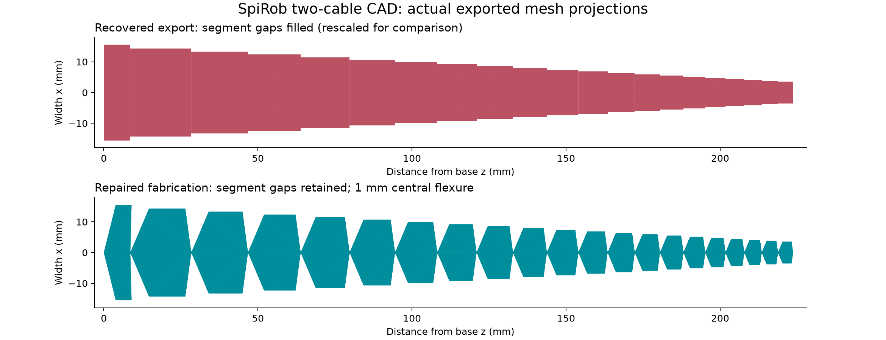

> Engineering history. For current commands, parameters and supported workflows, use the [main README](../../README.md).

# Consolidation repair — 8 September 2026

**Follow-up:** [Link frames and partial base correction](LINK_ORIENTATION_REPAIR.md)
documents the 9 September changes above `5d5b20a`. Byte-identity and CAD-volume
results in this original report describe the preceding repair, not the newly
corrected partial base.

The recovered two-cable CAD had lost the segment gaps and declared metre-sized
coordinates as millimetres. The repair restores the canonical segment outline,
exports at physical size, and checks both solid and mesh topology. It also fixes
build, splitter, array and GUI workflow defects.



The old mesh is multiplied by 1000 solely for this shape comparison. Its STEP
header actually declared millimetres. These XZ projections demonstrate segment
gaps, not through-thickness cable-hole geometry or mechanical performance.

## Exact starting points

- Published generator base: `55cc5f10594f9ada18d21b872e4d13fbc266e064`.
- Recovered bundle branch: `consolidate/openspirobs-features`.
- Recovered HEAD: `a980a612c5beb4218b4c09a582520ed0d98b0ed1`.
- Its preceding feature commits: `f389d26` and `0f93648`.
- Recovered bundle SHA-256: `521580f9e4e40b0716826ec4f0b141a790c0a8e6a0ed357e0362ff22a72e24d8`.
- Repair branch: `fix/consolidation-cad-workflows`.
- Downstream mjlab inspected at `ac92b4dda66450edf4cfc23a123c090c53117fe6`.

The Notion page named `0f93648` as final HEAD and a different bundle checksum.
The recovered bundle contains the later lens-section commit `a980a61`. Its
prerequisite and commit objects passed `git bundle verify`; it was imported
without rewriting the inherited commits.

Source handover: [Repo Consolidation](https://app.notion.com/p/3d2b0e637f3a81809732feb02bd0455b).

## Defects and repairs

| Defect reproduced or established in code | Repair |
|---|---|
| Two-cable loft uses joint Z for both centre and edge, filling segment gaps | Preserve all canonical quad vertices; closed piecewise planar lens segments |
| STEP coordinates around 0.224 but header `SI_UNIT(.MILLI.,.METRE.)` | CAD/print geometry explicitly scaled to mm; STEP re-import checks |
| Ideal simulation hinges lack a finite physical ligament | Configurable finite core; fabrication must contain exactly one valid solid |
| No drilled cable channels | Optional swept channels along canonical routed polylines; diameter explicit |
| CAD validity alone does not guarantee watertight exported STL | Remove duplicate/zero-area triangles, weld coincident vertices at 1e-7 mm, validate and re-import STL; no hole-filling repair |
| Shell-string build commands lose path boundaries and interpreter selection | `sys.executable` and argument arrays; paths resolved explicitly |
| Partial/stale mesh folders can be accepted as success | Fresh staging, complete binary STL set validation, MJCF compilation, output rollback on publish failure |
| README advertised `--nlobe` but parser rejected it | Restore compatible alias; cable count still selects section |
| Array leaves sensors/contact/equality references unchanged and loses relative assets | Rename typed references and names, keep world references shared, resolve assets before relocation, compile before write |
| Split box centred at origin on transverse axes | Centre it at the input bounding-box centre; test a solid translated kilometres in numeric CAD space |
| Invalid/duplicate cuts silently ignored; failed fit still reports success | Reject invalid cuts; explicit aggregate fit and failure exit |
| STL splitter misses `networkx` and `rtree` | Explicit optional dependency set |
| GUI touches widgets from workers; save failure does not stop build; CAD uses stale params | Main-thread queue, single active job, validated save gate, CAD rebuild through full pipeline |
| GUI has no splitter controls or exported-mesh inspection | Add both; array count/radius and output path editable |

## Validation performed

Environment: CPython 3.12.13, CadQuery 2.6.1, OCP 7.8.1.1.post1, MuJoCo 3.3.5,
NumPy 2.5.3, pandas 2.2.3, Matplotlib 3.11.1, trimesh 5.1.0. Requirements pin this
validated environment. This is a change from the historical NumPy/CadQuery
installation instructions; cross-version byte identity is not asserted.

- Recovered baseline suite: **185 passed, 1 xfailed**.
- Repaired suite: **198 passed, 1 xfailed** (50.10 s in this environment).
- The prior build-command test inspected a shell string literally. It now checks
  the actual stage arguments, including a parameter path with spaces.
- Separate full builds for 2, 3 and 4 cables all compiled in MuJoCo.
- Two-cable comparison against generator `main`, same interpreter/dependencies:
  geometry CSV + 21 per-link STL files + MJCF XML, **23/23 byte-identical**.
- Six-copy two-cable array, written in a different directory: **127 bodies,
  126 joints, 12 tendons, 12 actuators**. Three/four-cable single models each
  compile as 22 bodies, 21 joints and 3/4 tendons and actuators respectively.
- A separate fixture includes fixed-tendon joint references, sensor object and
  world reference names, equality constraints, contact exclusions and meshdir.
  Its relocated three-copy array compiles with each expected replicated count.
- STEP and STL splitting produce three parts of approximately 74.552 mm along
  Z, fitting a 256 mm cube. The translated-solid and STL-box tests verify volume
  conservation. Drilled two-cable STL splitting also returns closed volumes.
- Failed-build preservation, malformed mesh rejection, non-finite parameters,
  invalid/duplicate cut positions and invalid array counts are covered.

### Two-cable fabrication result

`examples/params-two-cable.json`, centre thickness derived from ratio 0.3,
edge ratio 0.25, core width 1 mm, cable-hole diameter 1 mm:

| Measurement | Result |
|---|---:|
| Width X | 31.087574 mm |
| Thickness Y | 9.326272 mm |
| Length Z | 223.655405 mm |
| CAD volume | 20,304.049177 mm³ |
| Number of CAD solids | 1 |
| STEP valid after re-import | yes |
| STL closed and consistently oriented after re-import | yes |

This is a concrete geometry demonstration, not a prescribed final print design.
`--cable-hole-diameter-mm 0` is the default, so the default solid is undrilled.

## Correct length interpretation

Canonical `LengthReport` gives requested and effective continuous lengths of
226.280000 mm, and discrete chord length of 223.6554047704 mm. Therefore
2.6245952296 mm is the **arc-to-chord deficit**. Unit-completion delta is zero.
The partial unit is `link_001` at the base. The previous handover's explanation
of a missing terminal partial tip unit is incorrect.

The canonical CSV base is at z=2.624595 mm and tip at z=226.280000 mm. Fabrication
translates this frame to put the base at z=0. It does not rescale the chain to
226.28 mm. The simulation's `post_gen` pose remains separate and unchanged.

## Remaining acceptance checks and scope limits

1. **Desktop GUI window unverified.** Tk imports, but opening the window raises
   `TclError: no display name and no $DISPLAY environment variable`. No display
   server is installed. Job-command and parameter-validation tests pass; these
   do not replace opening and exercising the actual desktop window.
2. **Physical performance unverified.** Lens/core dimensions and cable holes need
   printability, wall-thickness, mounting and bend-test review. No physical
   stiffness/damping equivalence, cable clearance qualification, printer trial
   or trained-policy transfer is claimed.
3. **Splitter is geometric.** It supplies no alignment pins, dovetails or bonded
   joint design; build-volume fit does not account for supports or clearances.
4. **Arrays are scoped to generator-style single-robot MJCF.** Assets remain on
   the same filesystem. Includes/keyframes/plugins/structural expansions fail
   explicitly; this is not a generic arbitrary-MJCF cloning library.
5. **MIT provenance boundary.** This repair does not use the authors' source.
   The inherited feature commits' clean-room provenance is their declared
   history and is not independently certified here.

## Repeat the principal checks

```bash
python -m pip install -r requirements-dev.txt
python -m pytest -q
python build.py --params examples/params-two-cable.json --no-preview --output-dir build/two --cad --cable-hole-diameter-mm 1
python build.py --params examples/params-four-cable.json --no-preview --output-dir build/four --cad
python tools/multi_array.py --in build/two/spirob_physics_model.xml --count 6 --out build/array/six.xml
python fabrication/part_splitter.py build/two/cad/spirob.stl --max-span-mm 100 --build-volume-mm 256,256,256
python design_gui.py --params examples/params-two-cable.json --output-dir build/gui
```
