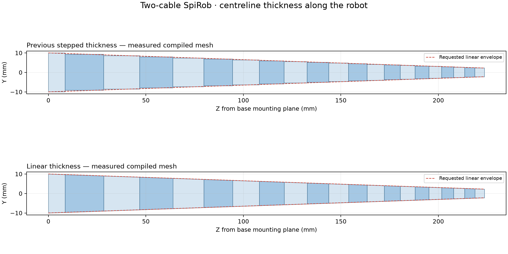

> Engineering history. For current commands, parameters and supported workflows, use the [main README](../../README.md).

# Continuous two-cable thickness

Two-cable models now taper in Y **within every link**, with matching centre
thickness on both sides of every joint in the straight configuration. This
applies to rectangular and six-sided sections. The existing XZ slit geometry,
flat base mounting face, body/joint/site names, cable routes and gain laws are
preserved. Mesh-derived mass, COM and inertia are recalculated for the new solid.



## What the base setting means

`--base-thickness-mm` remains the full centre thickness at the base mounting
plane. `auto` sets that dimension equal to the base width. Thickness then falls
linearly with axial distance, including through each individual element.
It is no longer a separate constant thickness proportional to each link width.

| Supplied two-cable geometry | Base mounting plane | Actual terminal tip |
|---|---:|---:|
| `--base-thickness-mm auto` | 31.087574 mm | 6.923663 mm |
| `--base-thickness-mm 20` | 20.000000 mm | 4.454296 mm |

The tip has no independent thickness input. To preserve a single shared STL
for all complete links, the taper follows their geometric scale progression.
Writing Z from the mounting plane, the law is

```text
T(Z) = T_base * (1 - Z / D)
```

Here D is the distance from the mounting plane to the virtual zero-size apex
of the continued complete-link sequence; it lies beyond the physical tip.
If adjacent tipward links have scale q, a complete link starting at z with
axial length l has virtual apex `z + l/(1-q)`. Every complete link gives the
same apex. This determines a continuous taper while keeping complete solids
geometrically similar. The partial base uses the same line and a separate STL.

The saved `section_dimensions.json` gives the law, base/tip dimensions, and
each link's `proximal_centre_thickness_m` and `distal_centre_thickness_m`.
Its per-link `centre_thickness_m` means the proximal value; the top-level
`tip.centre_thickness_m` means the final distal value. Positions in the report
are canonical CSV coordinates; subtract `linear_law.z_base_m` for distance
from the mounting plane.

For hex sections, `hex_edge_ratio` still specifies outer-edge/centre thickness
at a common Z station where the link has its full X width. Centre and edge
thickness both vary linearly with Z. Sloping hex faces are ruled CAD surfaces;
their intersections with sloping slit faces can be curved. Consequently a
whole-link end-on projection is not identical to a transverse planar slice.
The full-width transverse section remains six-sided. No XZ slit faces are
flattened or moved to force the projection to a polygon.

## Build and inspect

From the repository root, using the existing uv environment:

```bash
uv run python build.py \
  --params examples/params-two-cable-hex.json \
  --base-thickness-mm auto --thickness-profile linear \
  --timestep 0.0001 --collision-mode mesh --collision-margin-m 0 \
  --no-preview --cad --cad-profile simulation \
  --output-dir build/linear-thickness

uv run python tools/inspect_taper.py \
  --mjcf build/linear-thickness/spirob_physics_model.xml \
  --params build/linear-thickness/build_params.json \
  --out build/linear-thickness/taper.png \
  --json build/linear-thickness/taper.json --show

uv run python -m mujoco.viewer \
  --mjcf=build/linear-thickness/spirob_physics_model.xml
```

Use `examples/params-two-cable.json` for the rectangular section. Replace
`auto` with a number in mm to choose a base thickness. The linear profile is
the default even when `--thickness-profile` is omitted. In JSON it is
`"thickness_profile": "linear"`.

`inspect_taper.py` measures nine transverse cuts from each **compiled mesh**.
It fits a straight line to those measurements, checks the requested taper,
and compares extrapolated endpoint thicknesses across each joint. The default
acceptance tolerance is 0.0001 mm. A failed check exits with status 1. Its figure
shows measured centre thickness along YZ; it is not a collision approximation.
Use `--comparison-mjcf path/to/old.xml` to add a previous-model panel, provided
the old XML has the same XZ geometry, link names and body-frame convention.

The GUI's section preview now identifies its axial station; use the new
inspection tool for the complete axial taper. Supporting tools remain included.

## Compatibility and collision work

`--thickness-profile stepped` (or the equivalent JSON value) reproduces the
previous constant-thickness links. Old `flat_thickness_ratio` files remain
accepted: the ratio sets base thickness; the default profile is now linear.
Explicitly select `stepped` when reproducing or auditing an older XML.
New `build_params.json` files always record the profile.

For the subsequent collision update, see [CONVEX_COLLISION.md](CONVEX_COLLISION.md).
`--collision-mode convex` now provides one massless hull per two-cable link,
including the tapered hex section. That note documents its surface approximation.

The existing rectangular compound colliders describe constant-thickness
extrusions. They are rejected for the linear profile rather than silently
presented as matching its surface. Use mesh contacts for this shape review.
The legacy stepped rectangular model can still use the existing compound
colliders.
Three-or-more-cable geometry is unchanged.

Fabrication export uses the same tapered solids, adds the selected central
flexure and optional cable holes, and checks that the result is one valid solid.
CAD uses mm; simulation STLs use m. The inertia audit compares undrilled
homogeneous simulation solids, not measured printed hardware.

The parameter manual and concise README restructuring are deferred. This note
supersedes their older statements about a constant thickness per link.
